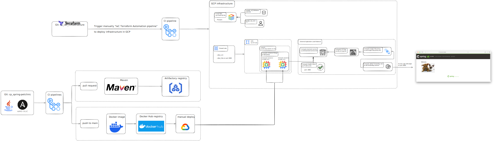

# Capstone Project: Spring PetClinic on GCP

This project is a cloud-deployed version of the [Spring PetClinic Sample Application](https://github.com/spring-projects/spring-petclinic), featuring full CI/CD, infrastructure automation, and monitoring.

## Project Components

- **Main Project Page**: [cp_main_capstone_project](https://github.com/mboguslawsk/cp_main_capstone_project)  
  Contains the architecture diagram and project overview.

- **Application**: [cp_spring-petclinic](https://github.com/mboguslawsk/cp_spring-petclinic)  
  Implements the Spring PetClinic application with CI/CD pipelines.

- **Infrastructure Automation**: [cp_iac_infrastructure](https://github.com/mboguslawsk/cp_iac_infrastructure)  
  Automates infrastructure setup using Terraform and Ansible with CI/CD integration.

- **Monitoring**: [cp_monitoring](https://github.com/mboguslawsk/cp_monitoring)  
  Provides monitoring for application and infrastructure health.

## Characteristics

| Feature | Technology / Tool |
|---------|------------------|
| Source code | GitHub |
| Cloud | Google Cloud Platform (GCP) |
| Infrastructure Automation | Terraform |
| Remote State Storage | Google Cloud Storage |
| Configuration Management | Ansible |
| CI/CD Automation | GitHub Actions |
| Build Tool | Maven |
| Artifacts | Docker images |
| Artifact Storage | Google Container Registry |
| Persistent Database | Cloud SQL (GCP) |
| Scripts | Python / Bash |

## Prerequesites

FOr terraform infra:

- One cloud bucket was created in GCP for tfstate file manually.
- One service account was created manually, for managing GHA. Created JSON_KEY for that. And added this JSON to the GitHub Actions Repository secrets GCP_JSON_SA_KEY.
- Created enviornment (production) before for approve functionality.

For Spring petclinic app:

- Created enviornment (production) before for approve jobs in pipeline
        - Added protection rule for waiting untill I approve it

- It was artifact registry created manually: cp-artifact-registry-bm

## Architecture diagram

Diagram was created using tool [excalidraw.com](https://excalidraw.com/) 

Digram can be view below:

  

