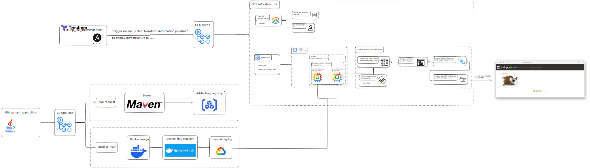
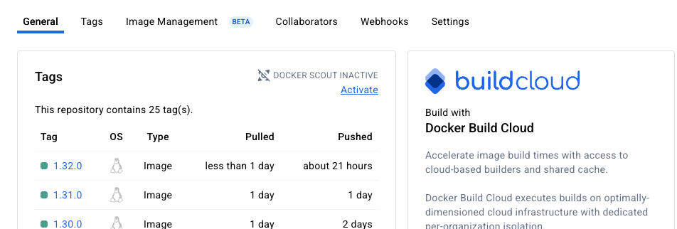
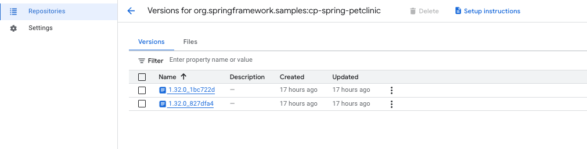
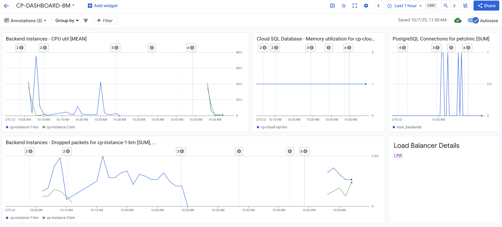

# Capstone Project: Spring PetClinic on GCP

This project is a cloud-deployed version of the [Spring PetClinic Sample Application](https://github.com/spring-projects/spring-petclinic), featuring full CI/CD, infrastructure automation, and monitoring.

## Project Components

* **Main Project Page**: [cp_main_capstone_project](https://github.com/mboguslawsk/cp_main_capstone_project)
  Contains the architecture diagram and project overview.

* **Infrastructure Automation**: [cp_iac_infrastructure](https://github.com/mboguslawsk/cp_iac_infrastructure)
  Automates infrastructure setup using Terraform and Ansible with CI/CD integration.

* **Application**: [cp_spring-petclinic](https://github.com/mboguslawsk/cp_spring-petclinic)
  Implements the Spring PetClinic application with CI/CD pipelines.

* **Monitoring**: [cp_monitoring](https://github.com/mboguslawsk/cp_monitoring)
  Provides monitoring for both application and infrastructure health.

## Characteristics

| Feature                   | Technology / Tool           |
| ------------------------- | --------------------------- |
| Source Code               | GitHub                      |
| Cloud Provider            | Google Cloud Platform (GCP) |
| Infrastructure Automation | Terraform                   |
| Remote State Storage      | Google Cloud Storage        |
| Configuration Management  | Ansible                     |
| CI/CD Automation          | GitHub Actions              |
| Build Tool                | Maven                       |
| Artifacts                 | Docker images               |
| Artifact Storage          | Google Container Registry   |
| Persistent Database       | Cloud SQL (GCP)             |
| Scripts                   | Python / Bash               |

## Prerequisites

### For Terraform infrastructure:

* A Cloud Storage bucket must be created in GCP manually for storing the Terraform state file.
* A service account with appropriate permissions must be created manually for GitHub Actions (GHA). Its JSON key must be added to the GitHub Actions repository secrets as `GCP_JSON_SA_KEY`.
* A production environment must be created in GitHub beforehand to enable approval functionality.

### For the Spring PetClinic application:

* GitHub environments must be created manually: **manual_deploy**, **push-main-build**, and **pr-build**. These enable approval steps in the pipeline.

  * Protection rules should be set so jobs wait until manual approval is granted.
* An Artifact Registry (`cp-artifact-registry-bm`) must be created in GCP for storing artifacts generated by the `pr-build` pipeline.

## Architecture Diagram

The architecture diagram was created using [Excalidraw](https://excalidraw.com/).

It can be viewed below:

  

## Steps for Using This Project

1. **Set up infrastructure**
   Use the [cp_iac_infrastructure](https://github.com/mboguslawsk/cp_iac_infrastructure) repository:

   * Start the pipeline **"IaC Terraform Automation"** manually. This will deploy the required resources and configure them using an Ansible playbook.
   * To destroy the infrastructure, simply approve the **destroy** job.

2. **Develop and deploy the application**
   Use the [cp_spring-petclinic](https://github.com/mboguslawsk/cp_spring-petclinic) repository:

   **Option A – Main branch deployment**

   * Push changes to the `main` branch.
   * The pipeline `push-main-build` will run automatically, building a new Docker image.
   * After the image is created, you can deploy it by approving the `manual_deploy` job.
   * Once deployed, the application will be accessible via the external IP address of the GCP load balancer.

   

     
   

   **Option B – Feature branch / PR workflow**

   * Create a new branch and submit a Pull Request.
   * After approval, a new JAR artifact will be built and uploaded to the Artifact Registry in GCP.

   

     
   

### 3. Monitoring

Use the [cp_monitoring](https://github.com/mboguslawsk/cp_monitoring) repository to set up monitoring dashboards.
This dashboard provides visibility into various architecture components and metrics within **Google Cloud Monitoring**.

  

  
